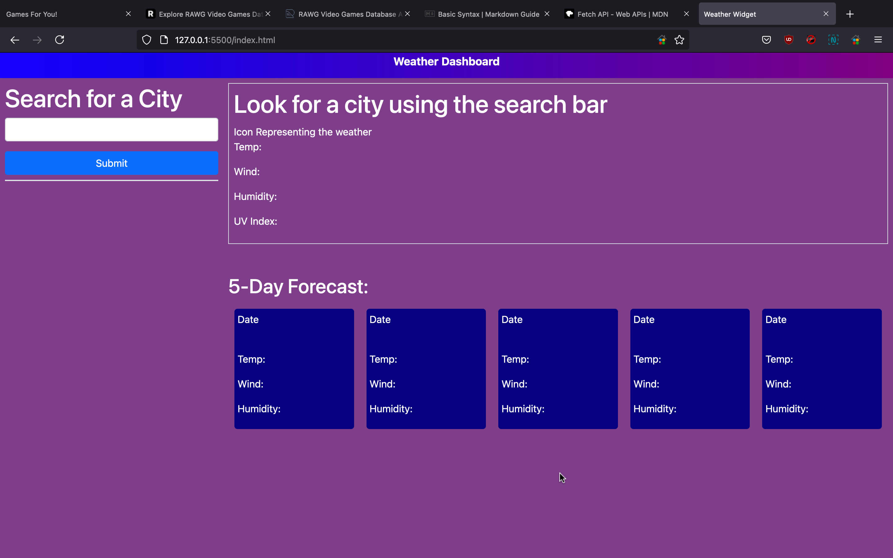
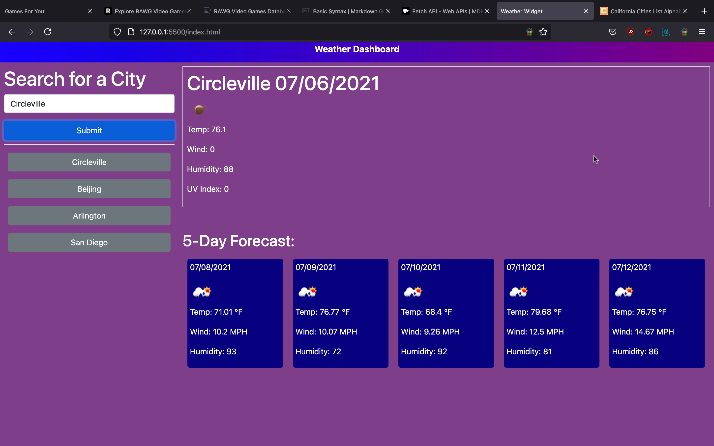
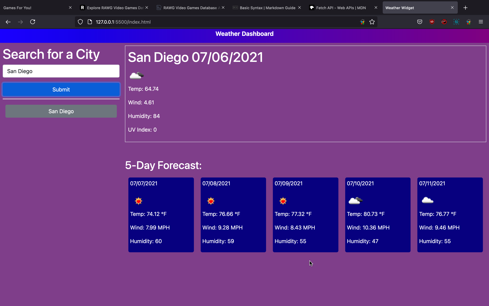
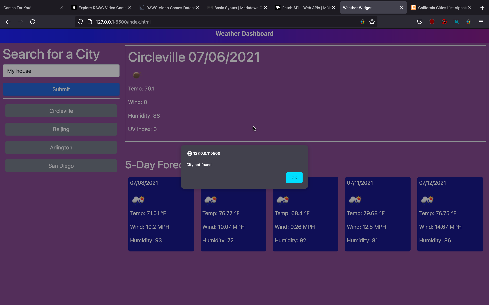

# Weather Widget
The goal of this project was to build a weather widget that tells the user the current weather and 5 day forecast for a certain city. To do this, I used the openweather API to get the necessary information. Additional, functionality includes a history of cities searched and the ability to load weather data for those cities when they are clicked on.

# Resources
- [Open Weather Map API docs](https://openweathermap.org/api)
- [MDN Fetch](https://developer.mozilla.org/en-US/docs/Web/API/Fetch_API)

# What I Did
[Deployed Application]()

